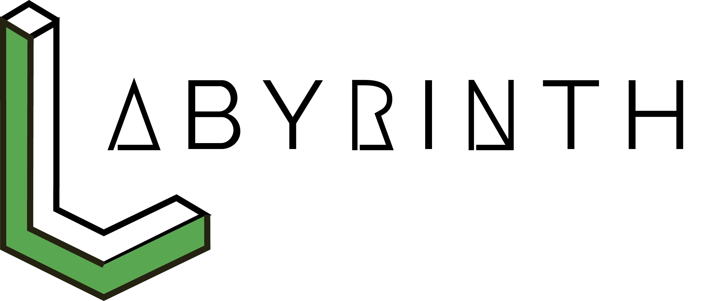

<h1 align="center"><center></center></h1>


[](https://gitter.im/fossasia/labyrinth?utm_source=badge&utm_medium=badge&utm_campaign=pr-badge&utm_content=badge)
[](https://travis-ci.org/fossasia/labyrinth)
[](http://isitmaintained.com/project/fossasia/labyrinth "Average time to resolve an issue")
[](http://isitmaintained.com/project/fossasia/labyrinth "Percentage of issues still open")
[](LICENSE)


[**Play Now**](http://labyrinth-game.surge.sh/) |
[**Learn How to Play**](http://labyrinth-game.surge.sh/howtoplay.html) |
[**Documentation**](http://labyrinth-game.surge.sh/documentation/)

## Content Outline
- [**Motivation**](#motivation)
- [**Implementation**](#implementation)
- [**Contributions, Bug Reports, Feature Requests**](#contributions-bug-reports-feature-requests)
- [**Issue and Branch Policy**](#issue-and-branch-policy)
- [**How to add new tiles**](#how-to-add-new-tiles)
- [**How to add a new character**](#how-to-add-a-new-character)
- [**How to add a new badge**](#how-to-add-a-new-badge)
- [**How to add new theme**](#how-to-add-new-theme)
- [**UI identity guideline**](#ui-identity-guideline)
- [**Videos about the Labyrinth**](#videos-by-students)
- [**Maintainers**](#maintainers)

This is a labyrinth software which can be edited by you.
This is an example in which direction we go:


Our goal is to have contributors like you draw parts of the labyrinth (Inkscape or hand drawn or other techniques), embed them into a huge labyrinth.
Possibly, we can have multiple levels all stuck together.

Motivation
----------

In the past two years, we created [Flappy SVG](http://fossasia.github.io/flappy-svg/).
We had problems coordinating because this is all one SVG file.
This time, we can allow contributors to work independently on a level and coordination comes with embedding.
This allows remixing of each other's work and thus collaboration in new ways such as:
- Adding your tile to an existing labyrinth
- Creating your own labyrinth from other tiles.

It is possible to extend the level in various ways: Keys, asking characters in the game, animation, moving through the game, multiple levels.
Also, we can create apps, credit pages and various other things with it.

Implementation
--------------

This will be an HTML/JS only site.

Contributions, Bug Reports, Feature Requests
--------------------------------------------

This is an Open Source project.
We would be happy to see contributors who report bugs, file feature requests and submit pull requests as well.
Please have a look at the [Contributing file](CONTRIBUTING.md) for ways to contribute.

## Issue and Branch Policy

- Before making a pull request, please file an issue. So, other developers have the chance to give feedback or discuss details.
- After writing your first commit, please open a pull request. 

Match every pull request with an issue please and add the issue number in description e.g. like "Fixes #123".

We have the following branch   
 * **master**   
   This contains shipped code. After significant features/bugfixes are accumulated on development, we make a version update, and make a release.


Also read [CONTRIBUTING.md](CONTRIBUTING.md)

If you like to join developing,

- you can [chat on gitter](https://gitter.im/fossasia/labyrinth?utm_source=badge&utm_medium=badge&utm_campaign=pr-badge&utm_content=badge), mentioning the maintainers.
- you can find/create [issues](https://github.com/fossasia/labyrinth/issues) and solve them.
  - When you solve an issue, you do not own it. Share your progress via a Pull-Requst as soon as possible.
  - Discuss with others who work on the issue about the best solution. It is your responsibility, not the maintainer's to choose the best solution.


## How to add new tiles

Labyrinth allows you to add your tiles by customizing the required javascript and svg files. There are various types of svg files which are available
such as doors, floors etc.

Currently the tiles are svg images which are embedded into a div via javascript. Floor tiles have a dimension of about 429.544 x 256.314 px (wxh)
Tiles are present in the `tiles` folder within subdirectories corresponding to particular tiles such as door, floor etc.

To create a tile you may use an svg editor such as inkscape. However other photo editors and formats do work if they are imported into the editor
and saved as a svg file with the specified dimensions.

Note: if you are copying the template of a tile(floor) from an existing tile, then do not edit it as a png but directly as a svg. This is so that errors in alignment do not exist and the tile(floor) is perfectly aligned.

After creating tiles add them to the specific sub folder inside tiles.

Now, we will move on to the javascript part.
Each tile's attributes and specifications along with it's declaration is done in the `js/tiles.js` file. You may edit this file defining attributes
such as how you could enter and exit out of the tile and so on. You can also specify the door it takes, it's closed exit paths etc.
A sample implementation should go into the already defined `door` class like:

```javascript
tile_name: Object.assign({}, OpenDoors, {
    canEnterFromTheRight() {return false;}, /* Set these to false to block movements on the right */
    canLeaveToTheRight() {return false;},
    /* Simillarly you can have canLeaveToTheTop(), canEnterFromTheTop() etc. */
    createImages: function() {
      this.wallTop = this.createImage("tiles/rooms/wall/top.svg"); /* Alter these attributes to specify a custom wall tile for the floor tile.  Do not forget to implement the movements with canEnter/LeaveFromTheRight, ... */
      this.wallRight = this.createImage("tiles/rooms/door/right.svg");
      this.ground = this.createImage("tiles/rooms/floor/svg_name.svg"); /*  svg_name is the name of your svg */
    },
  }),
```

If you want to display an alert box when the character reaches your tile, your implementation must be something like this :
```javascript
    visit: function() {
        alertNormal("title", "text");
        this.wallTop.show();
        this.wallRight.show();
        this.ground.show();
     },
```
Replace `alertNormal` with either `alertNormal`, `alertInfo`, `alertQuestion`, `alertSuccess`, `alertError` or `alertWarning`. For more info, [read this](http://sweetalert2.github.io/).

And replace `title` and `text` with whatever title or text you want to display.
If you want to only have a title and not any text, keep `text` empty. Like this : `""`.

<br>
After doing so now let's call the tile from the level so that they are reachable. You may modify `/js/levels.js` (which is currently the only level to include your tile.
Something like `door.tile_name` since we have added it (our object) to the door (which is a class). You may use css to animate the svg if you wish.

## How to add a new character

Labyrinth allows you to add your characters by customizing the required javascript and svg files.

Currently the characters are svg images which are embedded into a div via javascript. Characters have a dimension of about 55 x 60 px (wxh)
Characters are present in the `characters` folder.

To create a character you may use an svg editor such as inkscape. However other photo editors and formats do work if they are imported into the editor
and saved as a svg file with the specified dimensions.

After creating characters add them to the `characters` folder.

Now, we will move on to the javascript part.
Each character has only difference in it's appearance and hence can be injected via putting its name and location to the svg file in `gui.js`.
Follow the format while adding to gui.js (To be precise add it to the swal box input values collection i.e, into the `inputOptionsPromise` variable
under the `resolve` sub class.)
```javascript
"character_src": "character_name",
```


## How to add new theme
Adding new theme is basically adding new tiles in a constant object:
```javascript
const yourThemeName = {
  your tiles go here
},
```
While adding new theme you have to keep in mind theme structure. You can take a look at already existing themes.

After adding your theme to `tiles.js` file, you have to declare it in `levels.js`. Exactly its function, so it's going to create new tiles:
```javascript
function createXLevel() {
  return new Level("X", [
    [X.none, X.right, X.right, X.right, X.right, X.none],
    [X.none, X.top, X.both, X.both, X.both, X.both],
    [X.none, X.top, PlayerStartsAt(X.start), X.both, X.both, X.top],
    [X.none, X.top, X.both, X.both, X.both, X.top],
    [X.none, X.top, X.top, X.both, X.top, X.top],
    [X.none, X.top, X.both, X.both, X.both, X.top],
    [NullTile, X.none, X.none, X.none, X.none, X.none],
  ]);
}
```
That's just an example of this function. Note that all these functions in `levels.js` file are looking very similar. Instead of `X` sign insert your theme name.

To make the level available to the player, best if you also add a tile which you place in an
existing level which you want the player to explore before.
This tile then calls `player.addReachableLevel(createXLevel())` to make the level available to the player.

```javascript
visit: function(player) {
    player.addReachableLevel(createXLevel());
    // ...
  },
```
## How to add a new translation

Labyrinth needs your translations for make the game famous world-wide.

- Go to the `js\translate.js` and find English text(like following) that you have to translate.
- Check your language where there is or isn't. If not you can go to your language translation and find new strings not tranlated but in English translation

```javascript
  'language': 'Select your language',
  'how': 'How to play',
  'credit': 'Credits',
  'game': 'Game',
  'contribute': 'Contributors',
  'statistics': 'Statistics',
  'moved': 'Player Moved :',
  'times': ' Times',
  'audio': 'Audio',
  'now': 'Now Playing : ',
  'by': ' by ',
  'share': ' Share Game ',
  'follow': 'Follow us on',
  'invent': 'Inventory',
  \\like these
```

- Copy all the strings in English translate. And paste it after to last translation.
- Change `en` to two or three letters related for your language. Those two or three letters must be not used earlier for any translate.
      Ex:- For Sinhala use `si`, for Polski use `pl`
- Translate all the strings to your language and save it.
- Add flag that realated to the laguage in icons(You can find flag from this place https://en.wikipedia.org/wiki/Gallery_of_sovereign_state_flags). The flag must be 255 X 128 pixels and it must be png file. 
- Go to HTML files(index.html, howtoplay.html, credits.html, contributors.html) from your code editor.
- Then find following code from all the HTML files given and copy and past it after last language.

```HTML
<div class="hover-black">
  <a class="translate translate-language-choice waves-effect waves-light btn blue-grey darken-2" id="en">
    
     English
  </a>
</div>
```

- Change `img src="icons/UnitedKingdom.png"` to your flag and change " English" to your language name. (There must be a space before language name.)
- Now check all the pages from your internet browser and see it works.
- Done, Push your changes and create a pull-request and have it merged.

## How to Animate a Tile

1. Open the SVG file in Inkscape.
2. Click on the element you like to animate.
3. Go to `Object` > `Object Properties` or press `Control`+`Shift`+`o`.
4. Choose an Id for the object e.g. `asdf`. Please be aware that if you choose to animate a group, 
   you may need to set the id again after you ungroup it.

Now, you described what to animate.
Here is what you can do to add an animation:

1. Close Inkscape
2. Edit the SVG-File with a Text-Editor
3. Add the tag `<style>` to it and close it with `</style>`.
4. In between, you can add animations, see [this tutorial](https://www.w3schools.com/css/css3_animations.asp) using your Id, e.g. `#asdf {}`
5. When you animated something, you can view it in your browser.

## UI identity guideline
[Click here to read the full UI guideline](https://github.com/fossasia/labyrinth/UI_Identity.md)


## Videos by students
- [Labyrinth | A short intro](https://youtu.be/vc4GgDbx8WA)
- https://www.youtube.com/watch?v=5vXDJOYqWvk
- [Labyrinth : The Never Ending Maze by FOSSASIA](https://www.youtube.com/watch?v=XvoHY3QCJtw)
- https://www.youtube.com/watch?v=0Z144cuITCE
- [Labyrinth promotional video by Supun Tharinda Edirisuriya](https://www.youtube.com/watch?v=tHeScGOkJ3M)
- [Labyrinth - The Maze Game | Promo by Naveen Rajan](https://www.youtube.com/watch?v=R8dZjl7qqY8)
- [Labyrinth | Game by Fossasia](https://www.youtube.com/watch?v=nEJ5jAIRfjw)

## Maintainers

<table>
<tr>
<td>
     

     Nicco Kunzmann


<p align="center">
<a href = "https://github.com/niccokunzmann"></a>
<a href = "mailto:niccokunzmann@rambler.ru"></a>
<a href = "https://stackoverflow.com/users/1320237/user"></a>
</p>
</td>

<td>
     

     Mario Behling

<p align="center">
<a href = "https://github.com/mariobehling"></a>
<a href = "https://twitter.com/mariobehling"></a>
<a href = "https://www.linkedin.com/in/mariobehling/de"></a>
</p>
</td>

<td>
     

     Harsh Lathwal

<p align="center">
<a href = "https://github.com/xeon-zolt"></a>
<a href = "https://twitter.com/xeon_zolt"></a>
<a href = "https://www.linkedin.com/in/harsh-lathwal-75371276/"></a>
</p>
</td>

<td>
     

     Tarun Kumar

<p align="center">
<a href = "https://github.com/meets2tarun"></a>
<a href = "mailto:xeon.harsh@gmail.com"></a>
<a href = "https://www.linkedin.com/in/meets2tarun/"></a>
</p>
</td>


<td>
     

     Yash Kumar Verma


<p align="center">
<a href = "https://github.com/yashkumarverma"></a>
<a href = "https://stackoverflow.com/users/5131640/yash-kumar-verma?tab=profile"></a>
<a href = "https://www.linkedin.com/in/yash-kumar-verma/"></a>
<a href = "https://twitter.com/yash_kr_verma"></a>
</p>
</td>


</tr>
  </table>

Responsibilities:

- merge pull requests
- follow [CCCC](https://rfc.zeromq.org/spec:42/C4/)
- tag issues and pull requests to close after 3 days and close them after three to 7 days
  - if no updates are there
  - if there are no clear closig criteria
- merge patches
