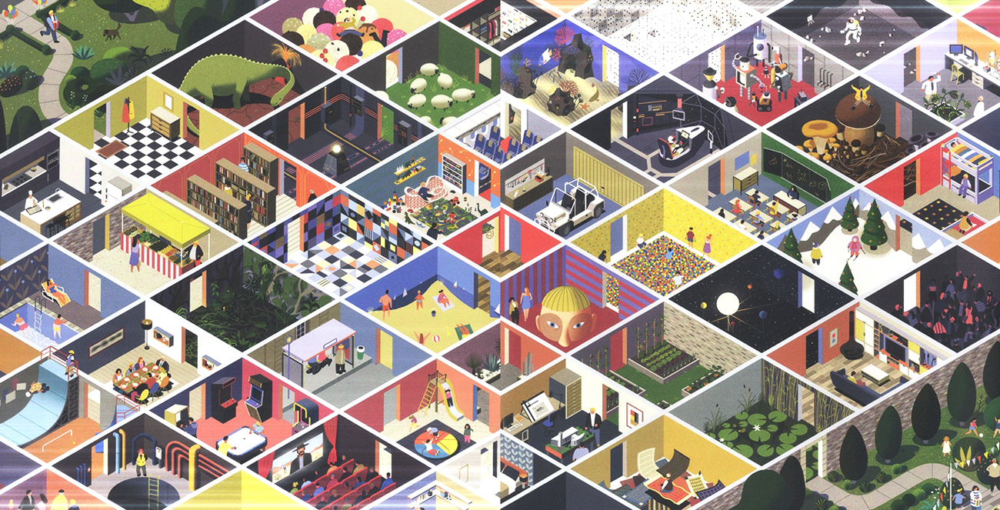
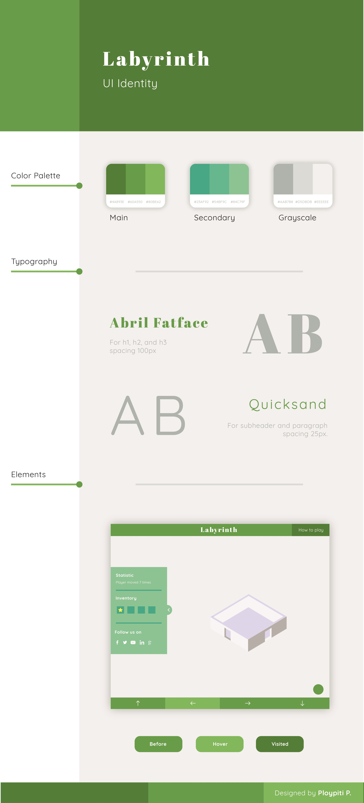

<h1 align="center"><center></center></h1>

[](https://gitter.im/fossasia/labyrinth?utm_source=badge&utm_medium=badge&utm_campaign=pr-badge&utm_content=badge)
[](https://travis-ci.org/fossasia/labyrinth)
[](http://isitmaintained.com/project/fossasia/labyrinth "Average time to resolve an issue")
[](http://isitmaintained.com/project/fossasia/labyrinth "Percentage of issues still open")
[](LICENSE)

[**Play Now**](http://rawgit.com/fossasia/labyrinth/master/index.html) | 
[**Learn How to Play**](http://rawgit.com/fossasia/labyrinth/master/howtoplay.html)
[**Documentation**](http://rawgit.com/fossasia/labyrinth/master/documentation/)

## Content Outline
- [**Motivation**](#motivation)
- [**Implementation**](#implementation)
- [**Contributions, Bug Reports, Feature Requests**](#contributions-bug-reports-feature-requests)
- [**Issue and Branch Policy**](#issue-and-branch-policy)
- [**How to add new tiles**](#how-to-add-new-tiles)
- [**How to add a new character**](#how-to-add-a-new-character)
- [**How to add a new badge**](#how-to-add-a-new-badge)
- [**How to add new theme**](#how-to-add-new-theme)
- [**Hints for GCI students**](#hints-for-gci-students)
- [**Solve an Issue**](#solve-an-issue)
- [**UI identity guideline**](#ui-identity-guideline)
- [**Videos about the Labyrinth**](#videos-by-students)
- [**Maintainers**](#maintainers)

This is a labyrinth software which can be edited by you.
This is an example in which direction we go:


Our goal is to have contributors draw parts of the labyrinth (Inkscape or hand drawn or other techniques), embed them into a huge labyrinth.
Possibly, we can have multiple levels all stuck together.

Motivation
----------

In the past two years, we created [Flappy SVG](http://fossasia.github.io/flappy-svg/).
We had problems coordinating because this is all one SVG file.
This time, we can allow contributors to work independently on a level and coordination comes with embedding.
This allows remixing of each other's work and thus collaboration in new ways such as:
- Adding your tile to an existing labyrinth
- Creating your own labyrinth from other tiles.

It is possible to extend the level in various ways: Keys, asking characters in the game, animation, moving through the game, multiple levels.
Also, we can create apps, credit pages and various other things with it.

Implementation
--------------

This will be an HTML/JS only site.
Levels can be created by editing a table specification.

Contributions, Bug Reports, Feature Requests
--------------
This is an Open Source project and we would be happy to see contributors who report bugs and file feature requests by submitting pull requests as well. Please report issues in the [GitHub tracker](https://github.com/fossasia/labyrinth/issues/new).

## Issue and Branch Policy

Before making a pull request, please file an issue. So, other developers have the chance to give feedback or discuss details. Match every pull request with an issue please and add the issue number in description e.g. like "Fixes #123".

We have the following branch   
 * **master**   
   This contains shipped code. After significant features/bugfixes are accumulated on development, we make a version update, and make a release.


Also read [CONTRIBUTING.md](CONTRIBUTING.md)

If you like to join developing,

- you can [chat on gitter](https://gitter.im/fossasia/labyrinth?utm_source=badge&utm_medium=badge&utm_campaign=pr-badge&utm_content=badge), mentioning the maintainers.
- you can find/create [issues](https://github.com/fossasia/labyrinth/issues) and solve them.
  - When you solve an issue, you do not own it. Share your progress via a Pull-Requst as soon as possible.
  - Discuss with others who work on the issue about the best solution. It is your responsibility, not the maintainer's to choose the best solution.


## How to add new tiles

Labyrinth allows you to add your tiles by customizing the required javascript and svg files. There are various types of svg files which are available
such as doors, floors etc.

Currently the tiles are svg images which are embedded into a div via javascript. Floor tiles have a dimension of about 429.544 x 256.314 px (wxh)
Tiles are present in the `tiles` folder within subdirectories corresponding to particular tiles such as door, floor etc.

To create a tile you may use an svg editor such as inkscape. However other photo editors and formats do work if they are imported into the editor
and saved as a svg file with the specified dimensions.

Note: if you are copying the template of a tile(floor) from an existing tile, then do not edit it as a png but directly as a svg. This is so that errors in alignment do not exist and the tile(floor) is perfectly aligned. 

After creating tiles add them to the specific sub folder inside tiles.

Now, we will move on to the javascript part.
Each tile's attributes and specifications along with it's declaration is done in the `js/tiles.js` file. You may edit this file defining attributes
such as how you could enter and exit out of the tile and so on. You can also specify the door it takes, it's closed exit paths etc.
A sample implementation should go into the already defined `door` class like:

```javascript
tile_name: Object.assign({}, OpenDoors, {
    canEnterFromTheRight() {return false;}, /* Set these to false to block movements on the right */
    canLeaveToTheRight() {return false;},
    /* Simillarly you can have canLeaveToTheTop(), canEnterFromTheTop() etc. */
    createImages: function() {
      this.wallTop = this.createImage("tiles/rooms/wall/top.svg"); /* Alter these attributes to specify a custom wall tile for the floor tile.  Do not forget to implement the movements with canEnter/LeaveFromTheRight, ... */
      this.wallRight = this.createImage("tiles/rooms/door/right.svg");
      this.ground = this.createImage("tiles/rooms/floor/svg_name.svg"); /*  svg_name is the name of your svg */
    },
  }),
```

If you want to display an alert box when the character reaches your tile, your implementation must be something like this :
```javascript
    visit: function() {
        alertNormal("title", "text");
        this.wallTop.show();
        this.wallRight.show();
        this.ground.show();
     },
```
Replace `alertNormal` with either `alertNormal`, `alertInfo`, `alertQuestion`, `alertSuccess`, `alertError` or `alertWarning`. For more info, [read this](http://sweetalert2.github.io/).

And replace `title` and `text` with whatever title or text you want to display.
If you want to only have a title and not any text, keep `text` empty. Like this : `""`.

<br>
After doing so now let's call the tile from the level so that they are reachable. You may modify `/js/levels.js` (which is currently the only level to include your tile.
Something like `door.tile_name` since we have added it (our object) to the door (which is a class). You may use css to animate the svg if you wish.

## How to Add Music

If you want to have a sound played when the character reaches your tile, your implementation must be something like this:

```javascript
    visit: function() {
      playAudio("audio.mp3", licenseNum);
      // ...
     },
```

The license numbers are as follows : 
1. Attribution 4.0 International
2. Attribution-NoDerivatives 4.0 International
3. Attribution-ShareAlike 4.0 International
4. Attribution-NonCommercial 4.0 International
5. Attribution-NonCommercial-NoDerivatives 4.0 International
6. Attribution-NonCommercial-ShareAlike 4.0 International

<br><br>

Note: if you are adding music to a tile then add it to: `audio/music` and if you are adding music as a background then add it to: `audio/background`! This is so that we can be organised and have a consistent filing system. 

To add your audio file, please read the following carefully:
Audio files are usually not licensed under AGPL. They have a different license.
Please **make sure that the license permits** using the file for the project.
Licenses which allow free usage are e.g. the Creative Commons Licenses: CC-BY, CC-BY-SA, CC-BY-NC, ... .
To add a sound file, we need to respect the license, so please follow this guide:
- [ ] Add your sound file to the [audio](audio) directory. Use a name which fits the sound.
- [ ] Add a file with the license of the sound file. If your file is named `audio.mp3` add a file named `audio.mp3.license`.
- [ ] If you created this sound, please consider adding the source files.

So, these two structures can exist in the audio folder:
- A single file with a license:
  ```
  audio/
  +- sound.mp3
  +- sound.mp3.license
  ```
- A folder for many sound files with one license:
  ```
  audio/
  +- source-name/
     +- LICENSE
     +- README.md
     +- sound1.mp3
     +- sound2.ogg
  ```

Please note that you **can** have both audio and alert box in your tile as well.

If you want to add a background music, add your music to `audio/background/` in the same way.
and update the `js/sound.js` file like so
```javascript
const backgroundAudio = [
    {
        filename : "Path of the file",
        backgroundSongName: "Name of the song",
        author: "Name of the author",
        legalNotice : "Music by author",
        link : "Link to author's website",
    },
];
```
Make sure you comply with the way the person wants this song to be cited and add this to `legalNotice` in HTML format.
This could be the same as the content of the license file for the file.

<br>

## How to add a new character

Labyrinth allows you to add your characters by customizing the required javascript and svg files.

Currently the characters are svg images which are embedded into a div via javascript. Characters have a dimension of about 55 x 60 px (wxh)
Characters are present in the `characters` folder.

To create a character you may use an svg editor such as inkscape. However other photo editors and formats do work if they are imported into the editor
and saved as a svg file with the specified dimensions.

After creating characters add them to the `characters` folder.

Now, we will move on to the javascript part.
Each character has only difference in it's appearance and hence can be injected via putting it's name and location to the svg file in `gui.js`.
Follow the format while adding to gui.js (To be precise add it to the swal box input values collection i.e, into the `inputOptionsPromise` variable
under the `resolve` sub class.)
```javascript
"character_src": "character_name",
```

## How to add a new badge

Players will achieve badge when they reach a certain tile, you may allow players to recieve badge when they reach your tile as well. To create a badge we'll need to upload your badge and modify `tiles.js`. As for designing the badge itself you may use Inkscape, Adobe Illustrator, or other photo editor, please make sure your badge is in .png format.

First, add your badge to `images/game/badges`, keep the *resolution* above ~100px but not above 330px (note that resolution are not dimension) to avoid broken image.

Next, in `tiles.js` add the following to your tile function;
```javascript
visit: function() {
        player.badges.add(['badgeName', 'fileName.png']);
        this.wallTop.show();
        this.wallRight.show();
        this.ground.show();
      }
```
You may add pop-up alert if you'd like, by using the *SweetAlert API*, for example;
```javascript
visit: function() {
    alertNormal("title", "text");
    // ...
  },
```
Replace `alertNormal` with either `alertNormal`, `alertInfo`, `alertQuestion`, `alertSuccess`, `alertError` or `alertWarning`. For more info, [read this](https://sweetalert2.github.io/).

And replace `title` and `text` with whatever title or text you want to display. If you want to only have a title and not any `text`, keep text empty. Like this : `""`.

## How to add new theme
Adding new theme is basically adding new tiles in a constant object:
```javascript
const yourThemeName = {
  your tiles go here
},
```
While adding new theme you have to keep in mind theme structure. You can take a look at already existing themes.

After adding your theme to `tiles.js` file, you have to declare it in `levels.js`. Exactly its function, so it's going to create new tiles:
```javascript
function createXLevel() {
  return new Level("X", [
    [X.none, X.right, X.right, X.right, X.right, X.none],
    [X.none, X.top, X.both, X.both, X.both, X.both],
    [X.none, X.top, PlayerStartsAt(X.start), X.both, X.both, X.top],
    [X.none, X.top, X.both, X.both, X.both, X.top],
    [X.none, X.top, X.top, X.both, X.top, X.top],
    [X.none, X.top, X.both, X.both, X.both, X.top],
    [NullTile, X.none, X.none, X.none, X.none, X.none],
  ]);
}
```
That's just an example of this function. Note that all these functions in `levels.js` file are looking very similar. Instead of `X` sign insert your theme name.

To make the level available to the player, best if you also add a tile which you place in an 
existing level which you want the player to explore before.
This tile then calls `player.addReachableLevel(createXLevel())` to make the level available to the player.

```javascript
visit: function(player) {
    player.addReachableLevel(createXLevel());
    // ...
  },
```

## Hints for GCI students

### Adding animated tiles

- Download and install [Inkscape](https://inkscape.org/en/)
- Create a tile with the same dimensions as those which are there. Ways of his tile must end at the middle of the edges.
- Use CSS to animate the tile in a way: Bird flapping/oven cooking/water dropping, ...
- While editing the game you may have ideas for improvement - add them as github [issue](https://github.com/fossasia/flappy-svg/issues).
- Create a pull-request and have it merged.

### Adding tiles for landscape

- Download and install [Inkscape](https://inkscape.org/en/).
- Create tiles with the same dimensions as those which are there. Ways of his tile must end at the middle of the edges.
- Add the tiles to the labyrinth, so they are reachable. Please create a small portion of the labyrinth with them to make it more exciting. You may get inspiration from other parts of the labyinth.
- Create a pull-request and have it merged.

### Creating a hand-drawn landscape

- Download and install [Inkscape](https://inkscape.org/en/)
- Create tiles with the same dimensions as those which are there. Ways of his tile must end at the middle of the edges. These tiles must be hand-drawn. A work-flow could be:
	1. Draw one tile on a sheet of paper
	2. Scan it or photograph it
	3. Make the unnecessary pixels/sections transparent - you can do that by using a PNG file or by clipping in Inkscape.
- Add the tiles to the labyrinth, so they are reachable. Please create a small portion of the labyrinth with them to make it more exciting. You may get inspiration from other parts of the labyrinth.
- Create a pull-request and have it merged.

### Add a new Pull request after solving a issue

- Go to the labyrinth [repository](https://github.com/fossasia/labyrinth). 
- Go to the [issue tab](https://github.com/fossasia/labyrinth/issues) and find a issue that you want to resolve or improve.
- Resolve/improve that issue and push those changes into your repo.
- Copy the issue number from issue tab.
- Go to your forked repository.
- Go to Pull Reqest tab.
- Click on New pull request.
- See there all files changes are ready or not(If not not follow next steps, please add your changes before proceed).
- Select base fork and head fork if it isn't not selected automatically.
- Click on Create Pull request.
- Change PR topic and message as instructions on it.
- Then click on create pull request.
<b>Now your pull request is ready!</b> See on [Pull requests](https://github.com/fossasia/labyrinth/pulls)

Solve an Issue
--------------
The FOSSASIA Labyrinth allows you to contribute parts to a huge labyrinth. Please improve the game by solving an issue.

- Comment on an issue that you want to do it. If you have solved several tasks on this game before, you can not claim tasks that are too easy for you because we need them to give others an easy start.
- Get assigned to the issue you work on, so other people coordinate with you. Being assigned an issue does not mean you can block progress by not answering.

## UI identity guideline
[Click here to read the full UI guideline](https://github.com/fossasia/labyrinth/UI_Identity.md)



## Videos by students
- [Labyrinth | A short intro](https://youtu.be/vc4GgDbx8WA)
- https://www.youtube.com/watch?v=5vXDJOYqWvk
- https://www.youtube.com/watch?v=XvoHY3QCJtw
- https://www.youtube.com/watch?v=0Z144cuITCE
- [Labyrinth promotional video by Supun Tharinda Edirisuriya](https://www.youtube.com/watch?v=tHeScGOkJ3M)
- [Labyrinth - The Maze Game | Promo by Naveen Rajan](https://www.youtube.com/watch?v=R8dZjl7qqY8)
- [Labyrinth | Game by Fossasia](https://www.youtube.com/watch?v=nEJ5jAIRfjw)

## Maintainers

<table>
<tr>
<td>
     
     
     Nicco Kunzmann


<p align="center">
<a href = "https://github.com/niccokunzmann"></a>
<a href = "mailto:niccokunzmann@rambler.ru"></a>
<a href = "https://stackoverflow.com/users/1320237/user"></a>
</p>
</td>

<td>
     
     
     Mario Behling

<p align="center">
<a href = "https://github.com/mariobehling"></a>
<a href = "https://twitter.com/mariobehling"></a>
<a href = "https://www.linkedin.com/in/mariobehling/de"></a>
</p>
</td>

<td>
     
     
     Harsh Lathwal

<p align="center">
<a href = "https://github.com/xeon-zolt"></a>
<a href = "https://twitter.com/xeon_zolt"></a>
<a href = "https://www.linkedin.com/in/harsh-lathwal-75371276/"></a>
</p>
</td>

<td>
     
     
     Tarun Kumar

<p align="center">
<a href = "https://github.com/meets2tarun"></a>
<a href = "mailto:xeon.harsh@gmail.com"></a>
<a href = "https://www.linkedin.com/in/meets2tarun/"></a>
</p>
</td>

</tr> 
  </table>
  
Responsibilities:

- merge pull requests
- follow [CCCC](https://rfc.zeromq.org/spec:42/C4/)
- tag issues and pull requests to close after 3 days and close them after three to 7 days
  - if no updates are there
  - if there are no clear closig criteria
- merge patches
