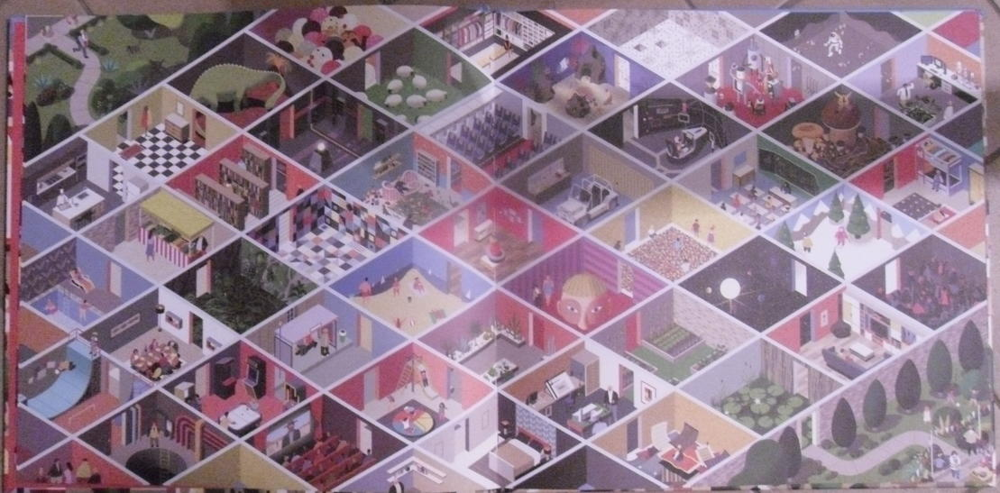

Labyrinth
=========

[**Play Now**](http://rawgit.com/fossasia/labyrinth/master/index.html)

This is a labyrinth software which can be edited by you.
This is an example in which direction we go:

Our goal is to have kids draw parts of the labyrinth (Inkscape or hand drawn or other techniques), embed them into a huge labyrinth.
Possibly, we can have multiple levels all stuck together.

Motivation
----------

In the past two years, we created [Flappy SVG](http://fossasia.github.io/flappy-svg/).
We had problems coordinating because this is all one SVG file.
This time, we can allow kids to work independently on a level and coordination comes with embedding.
This allows remixing of each other's work and thus collaboration in new ways such as:
- Adding your tile to an existing labyrinth
- Creating your own labyrinth from other tiles.

It is possible to extend the level in various ways: Keys, asking characters in the game, animation, moving through the game, multiple levels.
Also, we can create apps, credit pages and various other things with it.

Implementation
--------------

This will be an HTML/JS only site.
Levels can be created by editing a table specification.

Contributions, Bug Reports, Feature Requests
--------------
This is an Open Source project and we would be happy to see contributors who report bugs and file feature requests by submitting pull requests as well. Please report issues in the [GitHub tracker](https://github.com/fossasia/labyrinth/issues/new).

## Issue and Branch Policy

Before making a pull request, please file an issue. So, other developers have the chance to give feedback or discuss details. Match every pull request with an issue please and add the issue number in description e.g. like "Fixes #123".

<<<<<<< HEAD
<<<<<<< HEAD
We have the following branch   
=======
We have the following branches   
 * **development**   
   All development goes on in this branch. If you're making a contribution,
   you are supposed to make a pull request to _development_.
   PRs to master must pass a build check and a unit-test check on Travis.
>>>>>>> 47c573d... Added Documentation regarding Contributing
=======
We have the following branch   
>>>>>>> 0872e38... Update README.md
 * **master**   
   This contains shipped code. After significant features/bugfixes are accumulated on development, we make a version update, and make a release.

Also read [CONTRIBUTING.md](https://github.com/fossasia/labyrinth/blob/development/CONTRIBUTING.md)

If you like to join developing,

- you can [chat on gitter][gitter], mentioning the maintainers.
- you can find/create [issues](https://github.com/fossasia/labyrinth/issues) and solve them.
  - When you solve an issue, you do not own it. Share your progress via a Pull-Requst as soon as possible.
  - Discuss with others who work on the issue about the best solution. It is your responsibility, not the maintainer's to choose the best solution.
<<<<<<< HEAD
<<<<<<< HEAD
<<<<<<< HEAD
=======
.
>>>>>>> 47c573d... Added Documentation regarding Contributing
=======
.
>>>>>>> 0872e38... Update README.md
=======

Contributing to Tiles
--------------

## Create an animated tile

- Download and install [Inkscape](https://inkscape.org/en/)
- Create a tile with the same dimensions as those which are there. Ways of his tile must end at the middle of the edges.
- Use CSS to animate the tile in a way: Bird flapping/oven cooking/water dropping, ...
- While editing the game you may have ideas for improvement - add them as github [issue](https://github.com/fossasia/flappy-svg/issues).
- Create a pull-request and have it merged

## Create tiles for a landscape

- Download and install [Inkscape](https://inkscape.org/en/)
- Create tiles with the same dimensions as those which are there. Ways of his tile must end at the middle of the edges.
- Add the tiles to the labyrinth, so they are reachable. Please create a small portion of the labyrinth with them to make it more exciting. You may get inspiration from other parts of the labyinth.
- Create a pull-request and have it merged

## Create a hand-drawn landscape

- Download and install [Inkscape](https://inkscape.org/en/)
- Create tiles with the same dimensions as those which are there. Ways of his tile must end at the middle of the edges. These tiles must be hand-drawn. A work-flow could be:
	1. Draw one tile on a sheet of paper
	2. Scan it or photograph it
	3. make the unnecessary pixels/sections transparent - you can do that by using a PNG file or by clipping in Inkscape.
- Add the tiles to the labyrinth, so they are reachable. Please create a small portion of the labyrinth with them to make it more exciting. You may get inspiration from other parts of the labyrinth.
- Create a pull-request and have it merged.

Solve an Issue
--------------
The FOSSASIA Labyrinth allows you to contribute parts to a huge labyrinth. Please improve the game by solving an issue.

- Comment on an issue that you want to do it. If you have solved several tasks on this game before, you can not claim tasks that are too easy for you because we need them to give others an easy start.
- Get assigned to the issue you work on, so other people coordinate with you. Being assigned an issue does not mean you can block progress by not answering.
>>>>>>> 997edf8... Documentation regarding Contributing to Tiles and Solving Issues
