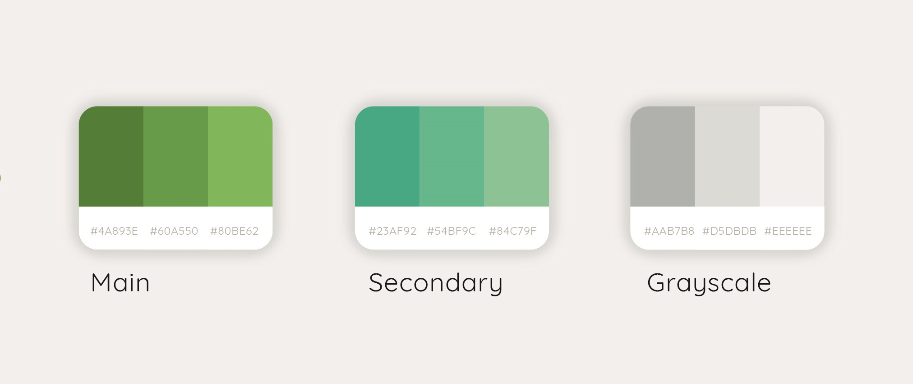
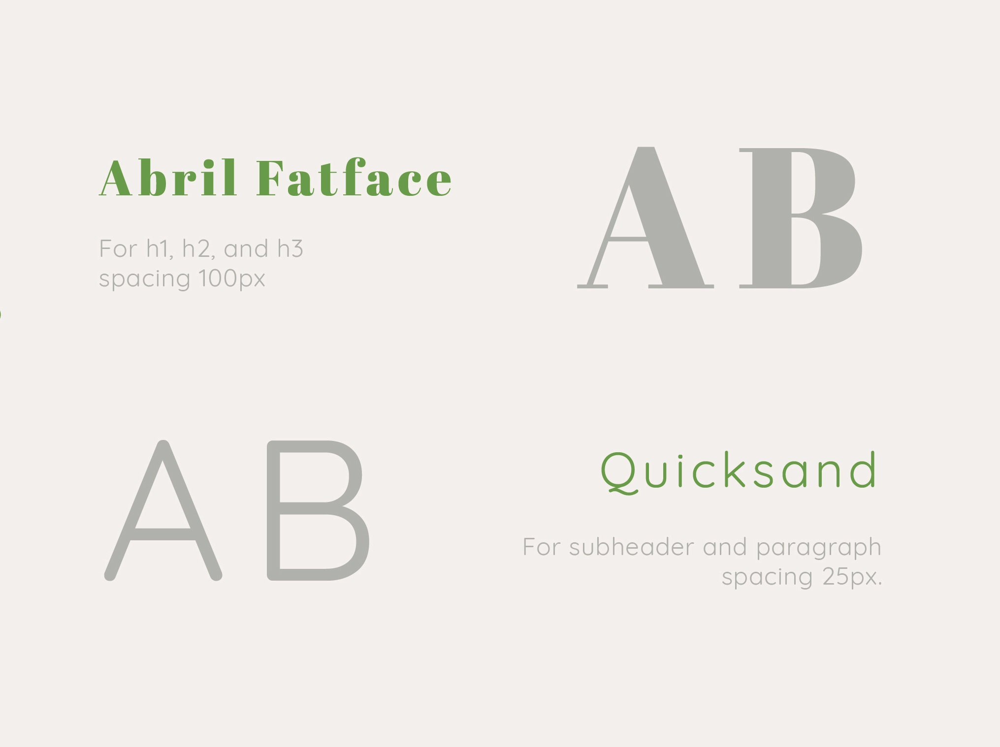
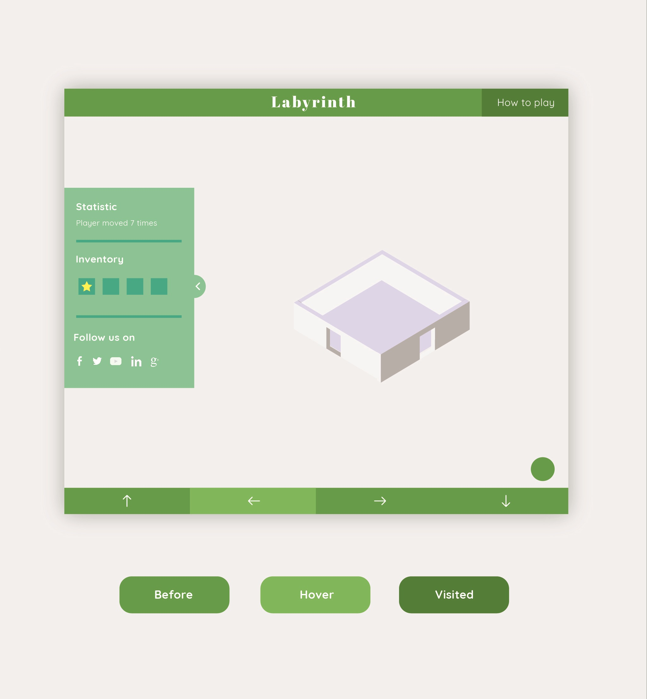

# UI identity guideline

## Color Palette

(From left to right)
- **Main** #4A893E, #60A550, #80BE62
- **Secondary** #23AF92, #54BF9C, #84C79F
- **Grayscale** #AAB7B8, #D5DBDB, #EEEEE

## Typography

- **For header; h1, h2, and h3** Abril Fatface, 100px spacing.
- **For subheading; h4, h5, h6, and paragraph** Quicksand Regular, 25px spacing.
- **For bold text** Quicksand bold, 25px spacing.

## Elements

- **Navigation bar** #60A550
- **Text on navbar** #fff
- **Hovered link/button** #80BE62
- **Visited link/button** #4A893E
- **Sidebar BG** #84C79F
- **Sidebar text** #fff
- **Blank inventory BG & sidebar border** #23AF92

---

_UI Designed by Ploypiti_
